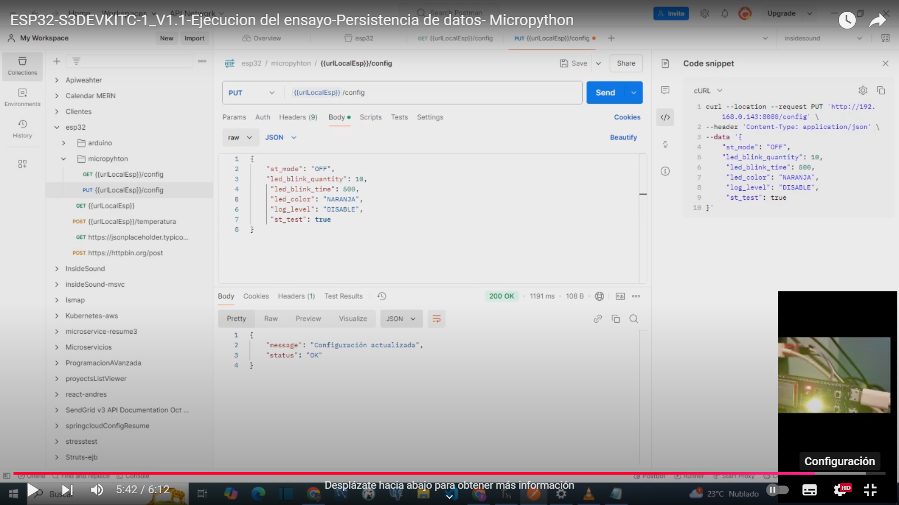
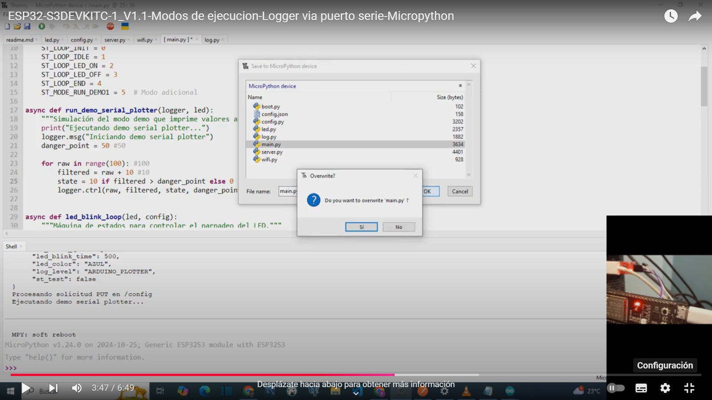

ESP32-S3DEVKITC-1_V1.1 Web-Controlled LED Blink Project
Project Overview
This project demonstrates a modular architecture for the ESP32 using MicroPython.
It is designed to support non-blocking control systems and features a web-based interface,
data persistence, and flexible debugging tools. The included example shows a flashing RGB LED controlled with adjustable non-latching timers.
The architecture is suitable for more complex applications such as motorized door systems with precise position tracking or TOF signal sampling with filter use..

Features
Non-Blocking Architecture: The system uses non-blocking timers for LED control, ensuring smooth operation without interfering with other processes.
Web Service Control: A web server on port 80 allows users to dynamically control settings and states via HTTP GET and PUT requests.
Data Persistence: Configurations are saved in a config.json file, ensuring settings are retained across reboots.
Logging Management: The log class handles structured logging for messages, tabulations, and Arduino Plotter-compatible formats via UART1. 
This allows for external debugging through a UART-to-USB converter. UART0 is reserved for the Python REPL console.
Extensible Design: The framework can be easily extended to include more complex devices and state machine-based controls.

Example Setup
The example project demonstrates the following:

Establishing a Wi-Fi connection.
Starting a web server for HTTP GET and PUT control endpoints.
Using non-blocking timers to control the LED blink rate.
Logging activity to the console for debugging and real-time monitoring.
This setup provides a foundation for extending the project to control other devices or implement additional state machines.

Configuration
Wi-Fi: Update ssid and password in the code to match your network details.
Default Settings:
LED blink time and quantity can be modified via web requests.
Configuration defaults are stored in config.json and loaded during startup.

API Endpoints
Retrieve Parameters
Retrieve the current configuration using the HTTP GET method:
Endpoint: GET /config

Example using cURL: curl --location 'http://<ESP32_IP>/config'

Modify Parameters
Update configurations or send commands using the HTTP PUT method:
Endpoint: PUT /config

Example using cURL: curl --location --request PUT 'http://<ESP32_IP>/config' \
--header 'Content-Type: application/json' \
--data '{ "led_blink_time": 500, "led_blink_quantity": 3 }'

vailable Parameters and Commands
Retrieve Current Configuration (GET)
To retrieve the current configuration of the system, use the following GET request:

GET /config

This will return the current settings in JSON format, including LED parameters, system mode, test state, and logging level:

{
    "led_blink_time": 500,
    "led_blink_quantity": 3,
    "st_mode": "OFF",
    "st_test": true,
    "led_color": "AZUL",
    "log_level": "DISABLE"
}

Update Configuration (PUT)
To update the configuration, use the PUT request with a JSON payload:

PUT /config

{
    "led_blink_time": 1000,
    "led_blink_quantity": 5,
    "st_mode": "DEMO",
    "st_test": true,
    "led_color": "VERDE",
    "log_level": "MESSAGE"
}

This will update the respective configuration parameters:

led_blink_time: The duration (in milliseconds) of each LED blink.
led_blink_quantity: The number of LED blinks to perform.
st_mode: The operational mode (e.g., "OFF", "DEMO", etc.).
st_test: Boolean flag to start the test mode.
led_color: The LED color ("ROJO", "AZUL", "VERDE", etc.).
log_level: The logging level ("DISABLE", "MESSAGE", "TABULATED", "ARDUINO_PLOTTER").
After updating, the new configuration is saved, and a response is returned:

{
    "status": "OK",
    "message": "Configuración actualizada"
}

LED Control
The Led class supports multiple colors, defined by RGB values. You can configure the LED behavior using the following parameters:

Set LED Color:

{ "led_color": "AZUL" }
Changes the LED to the specified color. Available colors and their RGB values are:

ROJO: (255, 0, 0)
AMARILLO: (255, 255, 0)
VERDE: (0, 255, 0)
BLANCO: (255, 255, 255)
AZUL: (0, 0, 255)
CIAN: (0, 255, 255)
MAGENTA: (255, 0, 255)
NARANJA: (255, 165, 0)
VIOLETA: (238, 130, 238)
GRIS: (169, 169, 169)
NEGRO: (0, 0, 0) (LED OFF)

Set LED Blink Time:
{ "led_blink_time": 500 }
Configures the duration (in milliseconds) of each blink.

Set LED Blink Quantity:
{ "led_blink_quantity": 3 }
Specifies how many times the LED blinks during the test mode.

Logging Configuration
The Log class manages the system's logging output. Logging can be set to one of the following levels:

Disable Logging:
{ "log_level": "DISABLE" }
Turns off all logging.

Message Logging:
{ "log_level": "MESSAGE" }
Logs basic system messages.

Tabulated Logging:
{ "log_level": "TABULATED" }
Provides structured, tabulated logs for better readability.

Arduino Plotter-Compatible Logging:
{ "log_level": "ARDUINO_PLOTTER" }
Formats logs for visualization in the Arduino Plotter.

By default, logs are output to UART1, which is connected to a USB-to-serial converter, leaving UART0 available for Python's REPL console.

State Machine and st_mode
The system uses a state machine (st_loop) to manage operational modes and transitions. Key states include:

ST_LOOP_INIT: Initialization state. Configures LED color, blink settings, and logging level based on the following conditions:

If st_test is enabled, initializes LED blinking with the configured parameters.
If st_mode is set to "DEMO", transitions to the demo run mode (ST_MODE_RUN_DEMO1).
ST_LOOP_IDLE: Idle state where the system waits for further commands or interactions.

ST_MODE_RUN_DEMO1: Demonstration mode. Executes predefined actions for testing purposes.

You can dynamically change the system's mode using the st_mode parameter:

Example Command to Start DEMO Mode:
{ "st_mode": "DEMO" }

Start Test Mode:
{ "st_test": true }

Example Configuration Command
You can send a JSON payload to configure multiple parameters at once.
For example:

{
    "st_mode": "DEMO",
    "led_color": "VERDE",
    "led_blink_time": 1000,
    "led_blink_quantity": 5,
    "log_level": "ARDUINO_PLOTTER",
    "st_test": false
}

This command:

Activates DEMO mode.
Sets the LED color to green.
Configures the LED to blink 5 times with a duration of 1 second per blink.
Enables arduino plotter logging output.

Problems in embedded firmware design

[Presentation](doc/embebidos.pdf)

ESP32-S3DEVKITC-1_V1.1-Test execution-Data persistence

ESP32-S3DEVKITC-1_V1.1 - Execution modes - Logger via serial port

Usage
Install Dependencies: Upload the required files (main.py, led.py, config.py, and config.json) to the ESP32 using Thonny IDE.
Run the Code: Power on the ESP32 and access the web interface.
Modify Settings: Use the provided endpoints to retrieve or update configuration parameters dynamically.
Author
Email: [educacion.ta@gmail.com]
Date: 24-11-2024

